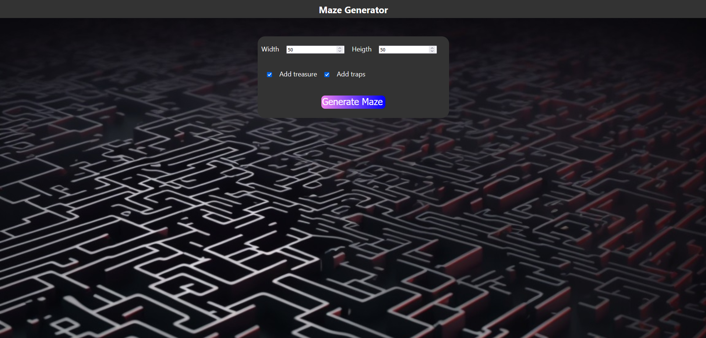
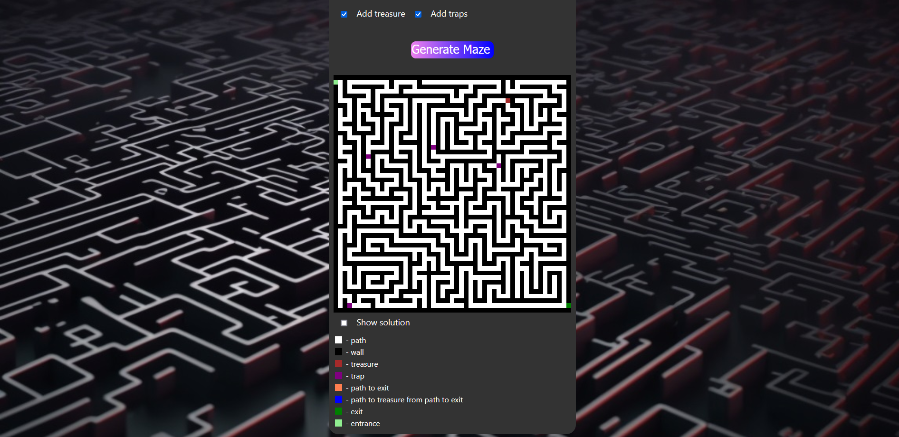
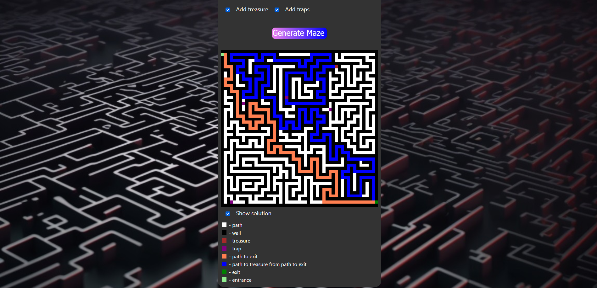

# Maze_generator

Simple web service to generate mazes with 1-cell walls.

## Notifications:
  - Maze with 1 cell wall is always odd height and width, so it will round your value up (for example, $`50\times 50`$ will generate maze $`51\times 51`$).
  - Works for non-square mazes.
  - You can add traps and|or treasure.
  - Tresuare is always reachable and can be on the direct way to exit.
  - There is 3-5 traps (if included), and you always can reach treasure and exit without triggering more than 2 of them.
  - Please, don't generate more that $` 250\times 250 `$ maze, it will be too big to display, and ruin page-design. (but it will still work)
  - Time complexion for generating maze $` M\times N`$ is $`O(M\cdot N) = 2^{M\cdot N} `$, because we have in average 2 directions to move for each cell, but in reality it can variaty because if path overlapping.
  - It also can be bigger because of usages of classes and high-level functions in js, which isn`t the fastest way of all possibles.
  - It took almost 6 hours to write algorithm and render of maze at front end, and about 2 hours for back-end and move some parts of generation here. 
  
## Algorithm
    
We use recursive backtracking algorithm for this task.

We generate path, not walls.
Idea is simple:
We choose first cell, then move to random next adjustent cell we haven't visited yet.
We move that way while we can.
We we can't, we return to previous cell and try to move again, while we can't move.
When we return to first cell, maze is complete - we made roads for this maze.

## Deployment:

Web server for our task created with Node.js, Express Framework.
Front is HTML CSS JS.

## To run program:
Requirements are Node.js installed,
To run this project got to Maze_generator folder and run command

    npm init
    
to init project, then 

    npm i
    
to install dependences.

run command

    npm start
    
It will run web server on http://localhost:3000.

## Some Showcases:

